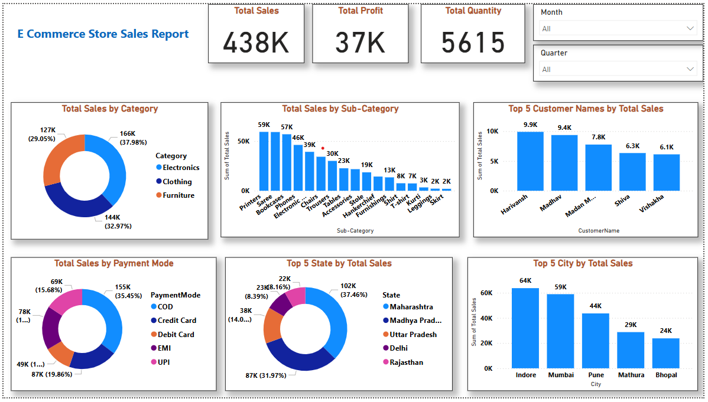

# 🛒 E-Commerce Sales Analysis – Brainwave Matrix Intern Task1

This project is part of my internship with **Brainwave Matrix Solutions**. I performed a detailed sales analysis using Power BI based on commercial store data.

---

## 📊 Dashboard Preview

---

## 📌 Key Insights

- **Total Sales:** ₹438K
- **Total Profit:** ₹37K
- **Total Quantity Sold:** 5615 Units
- **Top-Selling Category:** Electronics (₹166K)
- **Most Used Payment Mode:** Credit Card
- **Top State by Sales:** Maharashtra (₹102K)
- **Top Customer:** Harivansh (₹9.9K)

---

## 📈 Dashboard Highlights

- Sales by **Category** and **Sub-Category**
- Sales trends by **City**, **State**, and **Customer**
- Mode of **Payment**
- Time-based filters (Month & Quarter)

---

## 🧰 Tools Used

- Power BI (for visualization)
- Microsoft Excel (for raw data processing)
- GitHub (for version control & portfolio)

---

## 🚀 How to Use This Project

1. Clone or download the repository
2. Open `Report.pbix` in **Power BI Desktop**
3. Explore the dashboard and apply filters

---

## 🤝 Acknowledgment

This analysis was done as part of an internship project under **Brainwave Matrix Solutions**.

